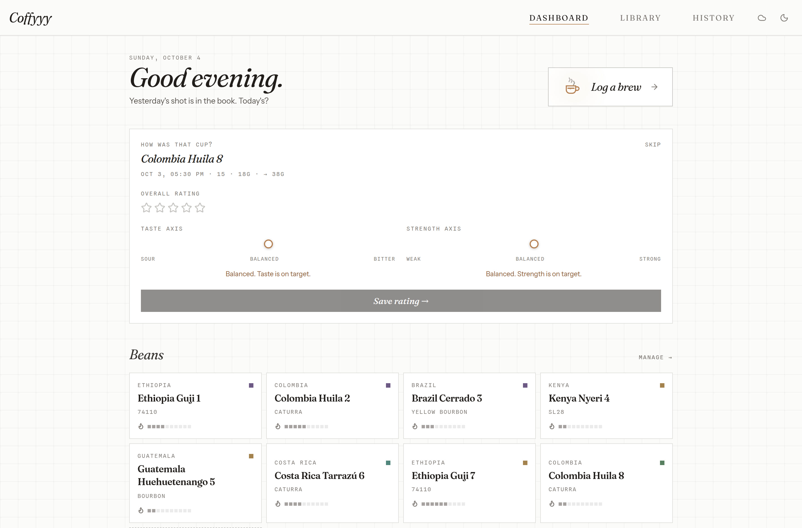
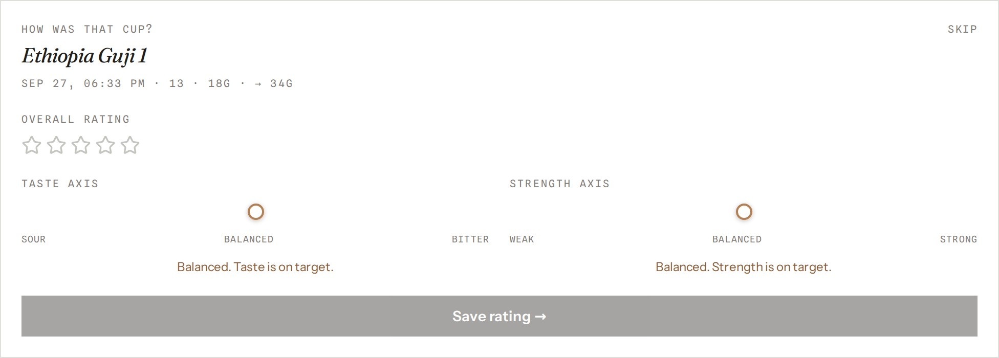
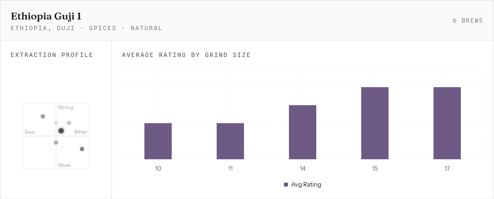

# Coffyyy

A personal passion project for coffee enthusiasts (me). It's a coffee journaling app that helps you track your espresso brews and keep in mind the setting that worked best. It also serves as a library of beans with relevant information about its origin, process, roast level, and tasting notes.



## Why does it exist ?

I started this project to get started down the rabbit hole of coffee brewing and learn more about the coffee brewing process. As a complete beginner, I wanted to build something that could help me understand the relationship between my machine's settings and the type of bean I was using. I wanted to create my own personal coffee app, with my vision and design in mind. 

## Features

Currently, the only metrics are the grind size, and user's direct feedback on the brew using a strength and bitterness rating (-5 to +5).
A more elaborate dashboard and statistics will be added in the future to understand the user's bean preferences and brew history.
<p align="center">
  
  
</p>

## Design system

The visual identity is documented in [docs/design-notes.md](./docs/design-notes.md) and lives as a living styleguide at `/buttons` (dev builds only).

Direction: **"calm instrument"** — neutral paper, near-black ink, hairlines and squares, one dusty caramel accent (the dial's needle, active states). Inspired by precision/editorial tooling; see the revision log in [docs/design-notes.md](./docs/design-notes.md).

- **Color** is built from semantic tokens in `src/index.css`: neutral `paper` surfaces, near-black `ink` text, hairline borders, and a single dusty caramel accent (`crema`) reserved for what is active or true. Flavor-note hues survive only as small square swatches. Dark mode is neutral near-black, no color cast.
- **Type** uses three faces with strict roles: **Fraunces** speaks (display, brand wordmark, italic voice), **Instrument Sans** works (body, forms, buttons), **Spline Sans Mono** measures (labels, recipes, ledger data). Everything maps through the `font-display` / `font-sans` / `font-data` / `.eyebrow` utilities.
- **Signature moment:** the brew dial on the log-a-brew page is a machined gauge — knurled collar, caramel arc that tracks the value, spring-settle needle. Echoes: bean cards as label plates (square hue swatch + rotated "Dialed in" stamp), a crema-fill cup animation when a shot is saved, and a time-of-day greeting on the dashboard.
- **Motion:** 300–500ms rise-and-fade on load with a 45ms stagger, 2px hover lift on cards, all disabled under `prefers-reduced-motion`.

## Stack & technical choices

I used a modern stack with React and Vite for the frontend, and NestJS for the backend. This stack is modern, fast and is something I feel comfortable with, and enjoy using.

### Frontend

Most of the frontend is built with React and Vite, using Tailwind CSS for styling. I'm using React's state management hooks to manage the application state.
Hosted on [Vercel](https://vercel.com/)

Stack:
- React 19 + Typescript
- Vite 7
- Tailwind CSS 4 (with `tw-animate-css`) and a semantic token layer (see Design system)
- Recharts for data visualization
- Shadcn UI ([shadcn/ui](https://github.com/shadcn/ui)) (component library)


### Backend

The initial release was local-only: the browser's IndexedDB stored application data through [Dexie](https://dexie.org/) and custom React hooks. The cloud architecture is now being introduced incrementally through the [Coffyyy backend](https://github.com/Zepyyy/Coffyyy-backend/).

The frontend communicates only with the NestJS API hosted on [Railway](https://railway.app/). NestJS uses Prisma to access the PostgreSQL database hosted on [Supabase](https://supabase.com/), which remains private behind the backend. Frontend code must not use `supabase-js`, Supabase service keys, or the Supabase Data API directly.

Stack:
- NestJS
- Swagger UI ([nestjs/swagger](https://github.com/nestjs/swagger)) (API documentation)
- Prisma ORM ([prisma](https://github.com/prisma/prisma)) (data modeling and database access)
- PostgreSQL (hosted on [Supabase](https://supabase.com/))

## Current State
The app remains local-first and can be used without an account or password. IndexedDB currently powers the app, so clearing browser storage will remove local data until sync is enabled.

Issue #10 Phase 1.5 is complete on backend `dev`: Railway staging commit `c665d917` passes cookie-session, CSRF, pairing, revocation, import-idempotency, expiry, and rate-limit checks. Backend `master` remains separate for production.

The frontend snapshot-sync implementation is complete on `cloud-sync-feature` and targets the new snapshot API. Backend snapshot migration is present on backend `dev` but is not yet deployed to staging; authenticated cross-browser rollout verification remains pending.

## Roadmap
- [x] Fully local IndexedDB implementation
- [x] Landing page with basic navigation
- [x] Dashboard connected to live data, showing charts and recent brews.
- [x] Issue #10 Phase 1: backend contract and security on backend `dev`
- [x] Issue #10 Phase 1.5: Railway staging deployment and verification
- [x] Issue #10 Phase 2: durable enrollment and snapshot sync groundwork
- [x] Issue #10 Phase 3: backend snapshot migration and deployed contract (backend code complete; staging deployment pending)
- [x] Issue #10 Phase 4: staging verification, rollout, and cleanup (blocked by staging deployment)
- [x] Visual identity pass: "roastery notebook" tokens, type system, machined dial, bag-label bean cards, save-shot celebration
- [ ] The [/history page](https://coffyyy.quentinstubecki.fr/history/) fully designed and implemented.

## Cloud sync model

Cloud sync is optional; local-only use remains the default. A user does not need a traditional account or password to use Coffyyy.

- **Enrollment:** the browser stores one active workspace ID and reusable sync code in dedicated Dexie metadata. Enable creates a workspace only once; reconnect never creates one implicitly.
- **Snapshots:** Push explicitly replaces the cloud snapshot; Pull replaces local data transactionally. Stable local IDs preserve brew relationships.
- **Offline behavior:** Pause stops push/pull but leaves the app usable. If local and cloud snapshots both changed, the user chooses Push local, Pull cloud, or Cancel.
- **Backup:** JSON export/import contains app data only, never enrollment or session credentials.
- **Session security:** authenticated requests use a server-managed `Secure`, `HttpOnly`, `SameSite` cookie session with server-side expiry and revocation. CSRF protection and rate limiting apply to cookie-authenticated mutations.
- **Browser storage:** JWTs and Supabase credentials are never stored in browser storage. Dexie stores local app data and the explicit enrollment metadata; the backend stores only a hash of the sync code.

## Project Structure

```text
src/
  components/     Feature-grouped UI: home/, library/, log/, history/, ui/ (+ Header nav)
  contexts/       Theme and sync-session contexts
  db/             Dexie database (db.ts) and local-cache CRUD helpers (crud/)
  hooks/          Shared hook types plus current live-query hooks and future API query hooks
  lib/api/        Data-layer adapters for beans, brews, machines, and stats
  pages/          Route components (incl. log/ subroutes)
  providers/      App-level providers (theme, query, sync session)
  types/          Shared TypeScript models (Bean, Brew, Machine)
```

`@/` is aliased to `src/`.

During the migration, components are being separated from persistence. Components should use the data-layer adapters and query/mutation hooks rather than calling Dexie directly. Dexie and its CRUD helpers remain behind the local-cache infrastructure; incremental pull is available through the sync data boundary.

## Getting Started

```bash
npm install
npm run dev
```

Open the local Vite URL shown in the terminal.

## Scripts

- `npm run dev` starts the development server.
- `npm run build` type-checks and builds the production bundle.
- `npm run preview` serves the built app locally.
- `npm run lint` runs ESLint.
- `npm run biome` formats `src/` with Biome.

Note: `npm run biome` uses `bunx`, so Bun must be installed even if you use npm for the rest of the project.
